# 人工智能与大数据实验室网站

一个基于 VitePress 构建的现代化学术实验室网站，配合 Spring Boot 后端实现内容管理。

## 功能特性

- 🏠 **首页展示** - 实验室概览、最新动态、统计数据
- 👥 **团队介绍** - 教师和学生信息展示，支持详情页
- 📚 **研究成果** - 学术论文、科研项目、学术会议、专利软著、竞赛获奖
- 📰 **新闻动态** - 实验室新闻发布与展示
- 💼 **管理后台** - 完整的内容管理系统

## 技术栈

### 前端
- [VitePress](https://vitepress.dev/) - 静态站点生成器
- [Vue 3](https://vuejs.org/) - 渐进式 JavaScript 框架
- 自定义组件库 - 教师/学生卡片、富文本编辑器等

### 后端
- [Spring Boot](https://spring.io/projects/spring-boot) - Java Web 框架
- [MyBatis Plus](https://baomidou.com/) - ORM 框架
- [阿里云 OSS](https://www.aliyun.com/product/oss) - 对象存储服务

## 项目截图

<p align="center">
  
  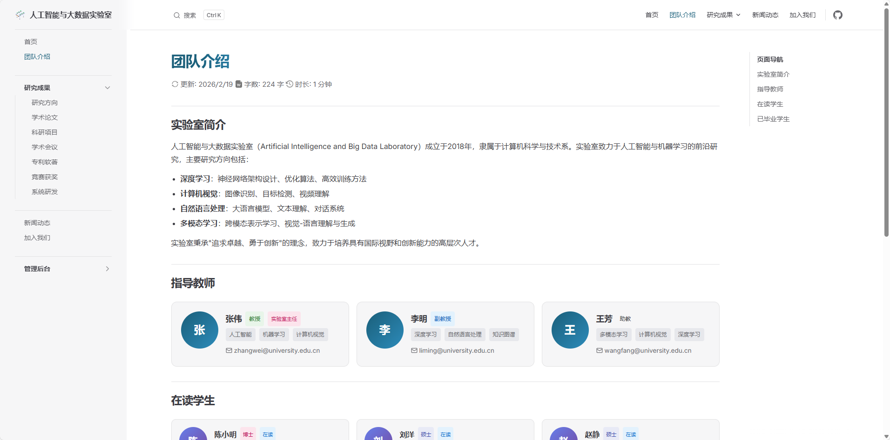
</p>

<p align="center">
  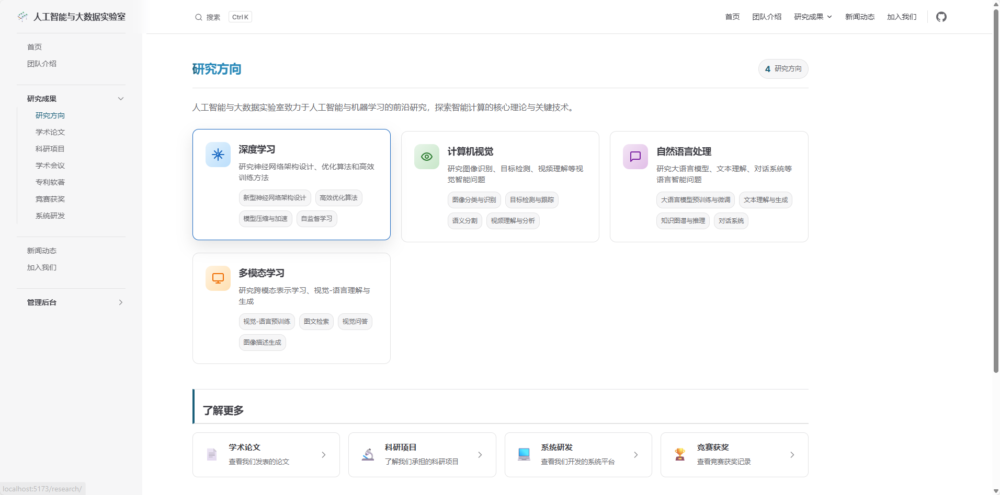
  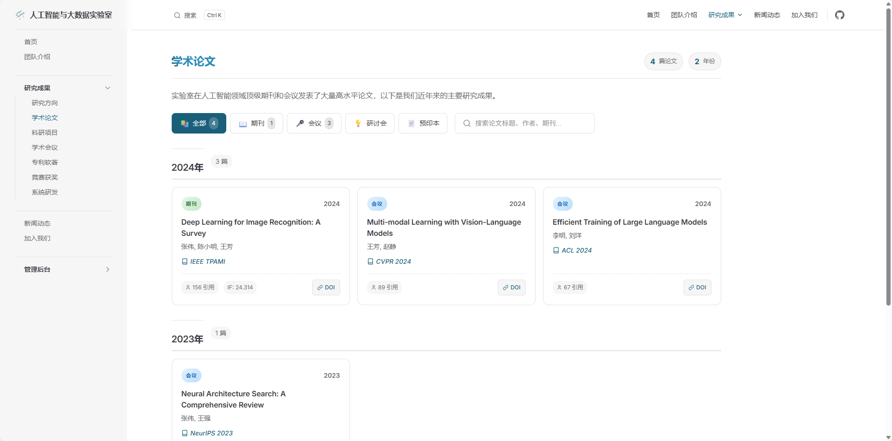
</p>

<p align="center">
  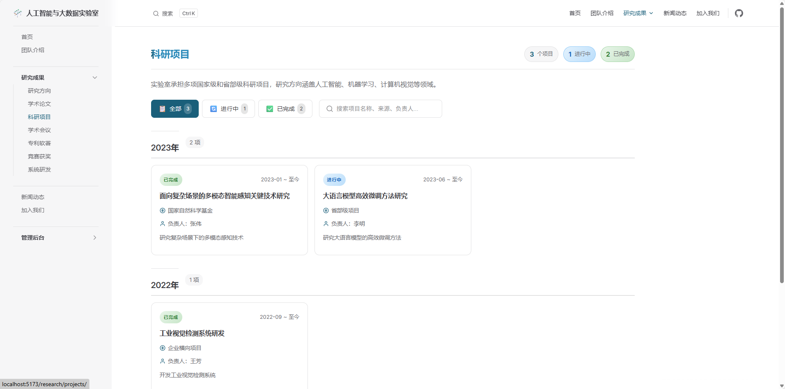
  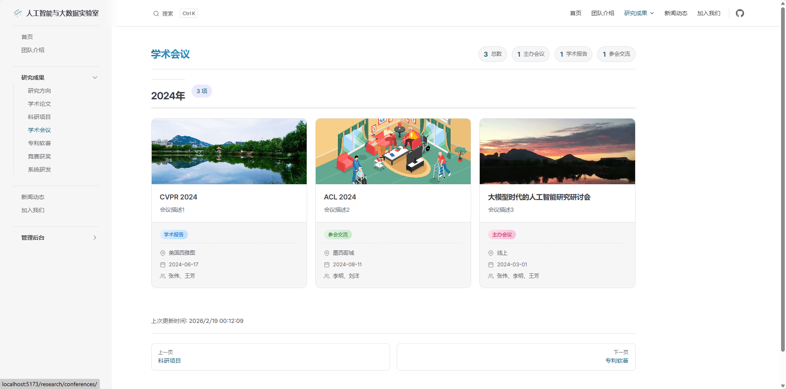
</p>

<p align="center">
  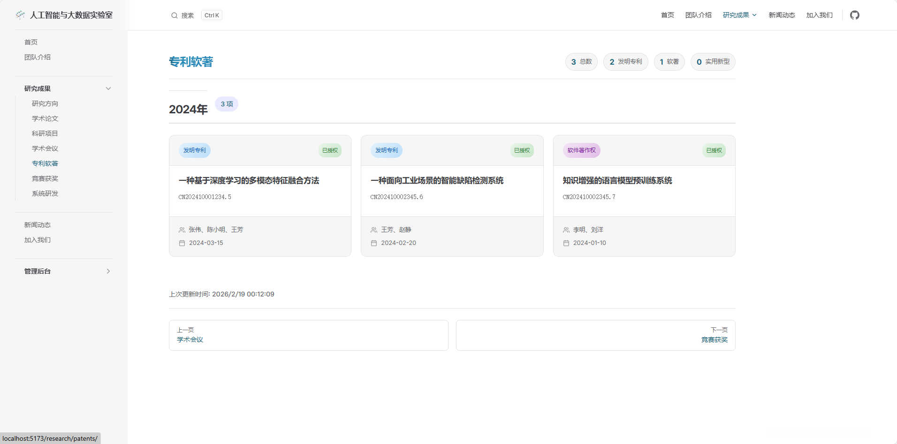
  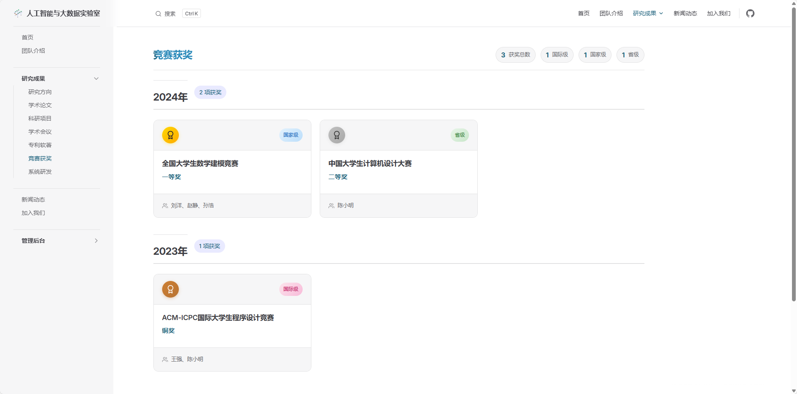
</p>

<p align="center">
  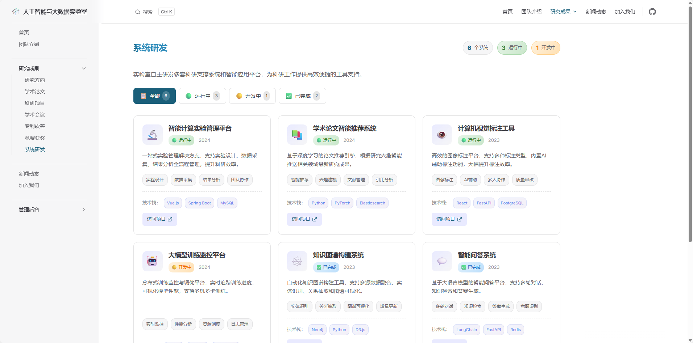
  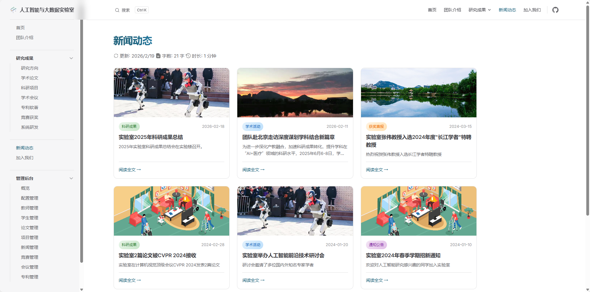
</p>

<p align="center">
  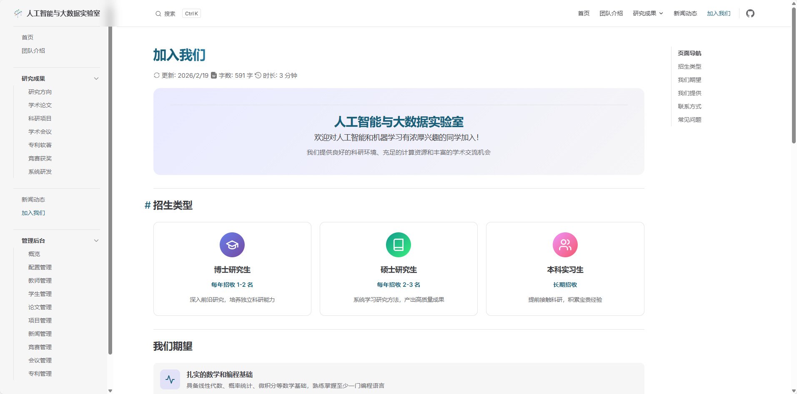
  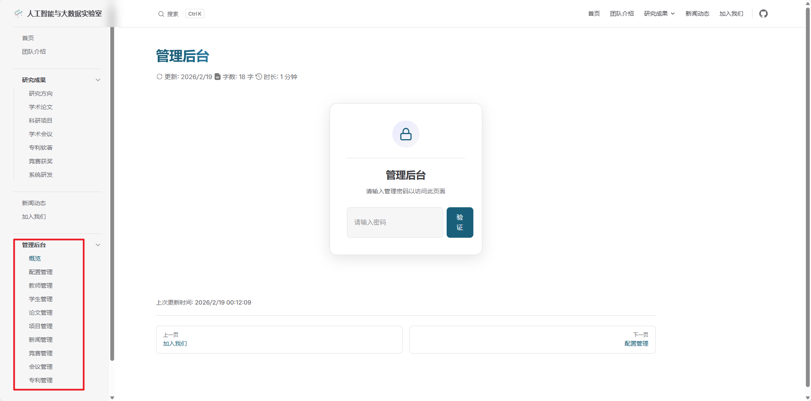
</p>


## 项目结构

```
vitepress-lab/
├── backend/                 # Spring Boot 后端
│   ├── src/main/java/       # Java 源码
│   │   └── com/lab/
│   │       ├── controller/  # 控制器
│   │       ├── service/     # 服务层
│   │       ├── mapper/      # 数据访问层
│   │       └── entity/      # 实体类
│   └── sql/                 # 数据库脚本
├── docs/                    # VitePress 前端
│   ├── .vitepress/          # 配置与主题
│   │   ├── theme/           # 自定义主题组件
│   │   └── config.mts       # VitePress 配置
│   ├── admin/               # 管理后台页面
│   ├── research/            # 研究成果页面
│   ├── team/                # 团队介绍页面
│   ├── news/                # 新闻动态页面
│   └── index.md             # 首页
├── img/                     # Github 仓库图片目录
├── .gitignore               # Git 忽略文件
├── LICENSE                  # 项目许可证
├── package-lock.json        # 前端依赖锁文件
├── package.json             # 前端依赖配置
└── README.md                # 项目说明文档
```

## 快速开始

### 前端

```bash
# 安装依赖
npm install

# 启动开发服务器
npm run docs:dev

# 构建生产版本
npm run docs:build

# 预览生产版本
npm run docs:preview
```

### 后端

1. 确保已安装 JDK 17+ 和 Maven
2. 配置 `application.yml` 中的数据库连接和 OSS 配置
3. 执行 `sql/init.sql` 初始化数据库
4. 运行 `LabBackendApplication.java`

## 管理后台功能

| 模块 | 功能 |
|------|------|
| 教师管理 | 添加、编辑、删除教师信息 |
| 学生管理 | 管理学生信息，支持在读/毕业状态 |
| 论文管理 | 学术论文的增删改查 |
| 项目管理 | 科研项目管理 |
| 新闻管理 | 实验室新闻发布 |
| 竞赛管理 | 竞赛获奖记录管理 |
| 会议管理 | 学术会议信息管理 |
| 专利管理 | 专利软著信息管理 |

## 自定义组件

- `FacultyCard` - 教师信息卡片
- `StudentCard` - 学生信息卡片
- `FacultyDetail` - 教师详情页
- `StudentDetail` - 学生详情页
- `RichTextEditor` - 富文本编辑器（基于 Quill）
- `ImageUpload` - 图片上传组件
- `NewsCard` - 新闻卡片
- `PaperCard` - 论文卡片
- `ProjectCard` - 项目卡片
- `StatCard` - 统计数据卡片

## 配置说明

### 前端配置

编辑 `docs/.vitepress/config.mts` 文件：

```javascript
export default defineConfig({
  title: "人工智能与大数据实验室",
  description: "探索人工智能前沿，创造智能未来",
  // ... 其他配置
})
```

#### 管理后台密码设置
默认密码为 `icl2024`

修改密码请编辑 `docs/admin/*.md` 等文件中的 `<AuthGuardpassword="your_password">` ,将`your_password` 替换为您的密码。

### 后端配置

编辑 `backend/src/main/resources/application.yml`：

```yaml
spring:
  datasource:
    url: jdbc:mysql://localhost:3306/lab_website?useSSL=false&serverTimezone=Asia/Shanghai&characterEncoding=utf8
    username: your_username
    password: your_password
......
aliyun:
  oss:
    endpoint: your-endpoint
    access-key-id: your-access-key-id
    access-key-secret: your-access-key-secret
    bucket-name: your-bucket-name
    base-url: your-base-url
```

## 部署

### 前端部署

```bash
npm run docs:build
```

将 `docs/.vitepress/dist` 目录部署到静态服务器。

### 后端部署

```bash
cd backend
mvn clean package
java -jar target/lab-backend.jar
```

## 许可证

MIT License

## 联系方式

如有问题或建议，请提交 Issue 或 Pull Request。

Github 仓库：[https://github.com/sheepfishzhuo/vitepress-lab](https://github.com/sheepfishzhuo/vitepress-lab)
